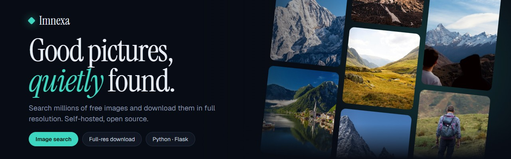
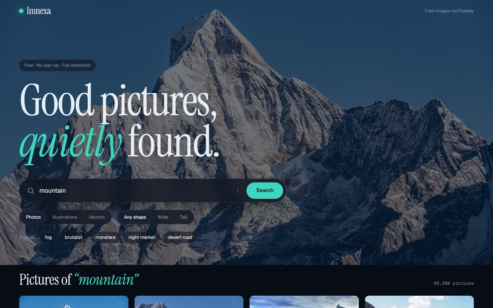
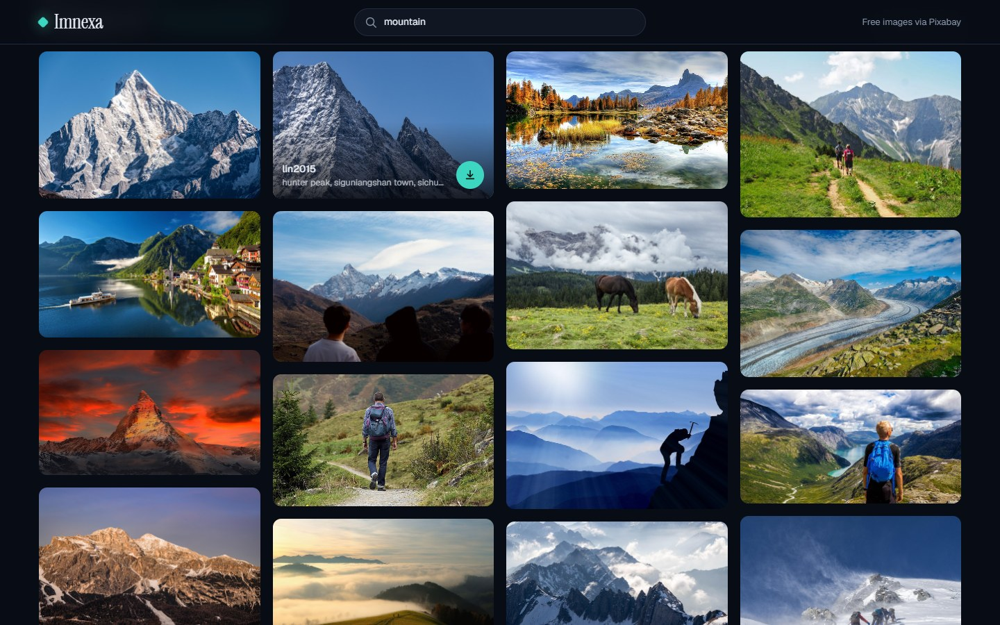
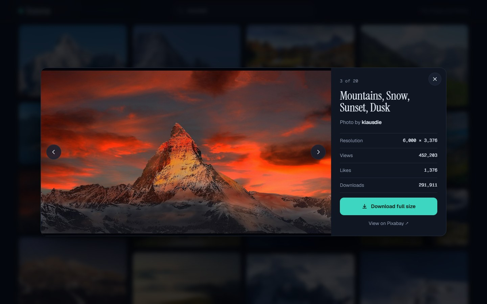
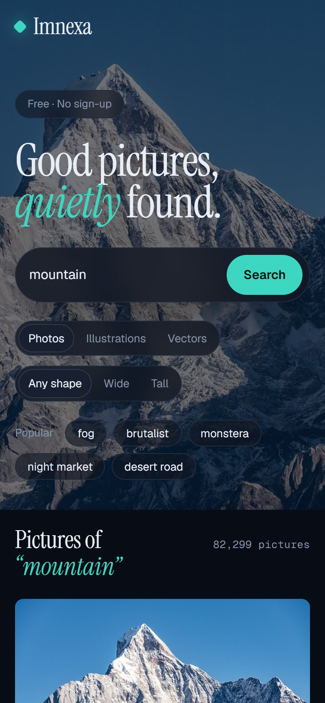

<p align="center">
  
</p>

<h1 align="center">Imnexa – Image Search &amp; Downloader</h1>

<p align="center">
  <strong>Free, open-source image search and downloader powered by the Pixabay API.</strong><br>
  Search millions of royalty-free photos, illustrations and vectors, preview them, and download full resolution.<br>
  Built with Python Flask. Self-hosted. Dark UI.
</p>

<p align="center">
  <a href="https://python.org"></a>
  <a href="https://flask.palletsprojects.com"></a>
  <a href="https://pixabay.com/api/docs/"></a>
  <a href="LICENSE"></a>
  <a href="https://github.com/Karthigamurugadoss/imnexa-image-downloader/releases/latest"></a>
  <a href="https://github.com/Karthigamurugadoss/imnexa-image-downloader/stargazers"></a>
  <a href="https://karthigamurugadoss.github.io/imnexa-image-downloader/"></a>
</p>

<p align="center">
  <a href="https://karthigamurugadoss.github.io/imnexa-image-downloader/">Website</a> &nbsp;&middot;&nbsp;
  <a href="#features">Features</a> &nbsp;&middot;&nbsp;
  <a href="#getting-started">Getting Started</a> &nbsp;&middot;&nbsp;
  <a href="#usage">Usage</a> &nbsp;&middot;&nbsp;
  <a href="#security">Security</a> &nbsp;&middot;&nbsp;
  <a href="#faq">FAQ</a> &nbsp;&middot;&nbsp;
  <a href="#contributing">Contributing</a>
</p>

---

**Imnexa** is a modern, self-hosted web app for finding and downloading free stock images. It uses the official [Pixabay API](https://pixabay.com/api/docs/) to search **photos, illustrations and vectors**, shows the results in a true-proportion masonry grid, lets you inspect any picture in a built-in viewer, and downloads the **full-resolution file** with one click.

It is a small Flask app with no build step, so you can read all of it in a few minutes.

> **Note:** Images come from [Pixabay](https://pixabay.com) and are covered by the [Pixabay Content License](https://pixabay.com/service/license-summary/). Imnexa is an independent project and is not affiliated with Pixabay.

---

## Screenshots

| Search | Results & hover download |
|:---:|:---:|
|  |  |

| Picture viewer |
|:---:|
|  |

<details>
<summary><strong>Mobile view</strong></summary>
<br>

<p align="center">
  
</p>
</details>

---

## Features

- **Instant image search** across the Pixabay library of free photos, illustrations and vectors
- **Full-resolution download** in one click, named by Pixabay ID with the right file type
- **Type and shape filters**: Photos, Illustrations, Vectors, and Any / Wide / Tall
- **Built-in viewer** with resolution, views, likes and downloads, plus keyboard navigation (`←` `→` `Esc`)
- **True-proportion masonry grid** with skeleton loading and a "Show more pictures" button
- **Shareable searches**: every search has a link such as `/?q=mountain`
- **24-hour search cache**: repeat searches are instant and save your API rate limit (Pixabay's API terms require caching)
- **Dark, responsive UI** that works from phone to ultrawide, with a sticky compact search
- **Secure by default**: API key stays on the server, strict CSP, Pixabay-only download proxy

### Keyboard shortcuts

| Key | Action |
|-----|--------|
| `/` | Focus the search box |
| `←` / `→` | Previous / next picture in the viewer |
| `Esc` | Close the viewer |

---

## Tech Stack

| Component | Technology |
|-----------|------------|
| Backend | Python, Flask |
| Image source | Pixabay API |
| HTTP client | Requests |
| Config | python-dotenv |
| Frontend | HTML5, CSS3, vanilla JavaScript |
| Type | Instrument Serif, Geist, Geist Mono |

---

## Getting Started

### Prerequisites

- **Python 3.9+**: [Download Python](https://www.python.org/downloads/)
- **A free Pixabay API key**: sign in and copy it from [pixabay.com/api/docs](https://pixabay.com/api/docs/)

### Installation

```bash
# Clone the repository
git clone https://github.com/Karthigamurugadoss/imnexa-image-downloader.git
cd imnexa-image-downloader

# Install dependencies
pip install -r requirements.txt

# Add your API key
cp .env.example .env        # on Windows: copy .env.example .env
# then open .env and paste your key after PIXABAY_API_KEY=

# Run the application
python app.py
```

Open your browser and go to **http://127.0.0.1:5000**

### Configuration

| Variable | Required | Description |
|----------|----------|-------------|
| `PIXABAY_API_KEY` | Yes | Your Pixabay API key (kept in `.env`, never committed) |
| `PORT` | No | Port to listen on (default `5000`) |
| `FLASK_DEBUG` | No | Set to `1` for auto-reload while developing (off by default) |

---

## Usage

### Search for images

1. Type a word into the search bar and press **Enter**
2. Pick **Photos**, **Illustrations** or **Vectors**, and **Any shape**, **Wide** or **Tall**
3. Scroll the grid and click **Show more pictures** for the next page

### Download an image

1. Hover a picture and click the round **download** button, or
2. Click the picture to open the viewer and choose **Download full size**

### Share a search

Searches update the URL, so you can bookmark or send a link like `http://127.0.0.1:5000/?q=desert+road`.

---

## Security

Imnexa is designed so there is little to get wrong. Full details are in [SECURITY.md](SECURITY.md).

- The **API key never reaches the browser** and never appears in error messages
- `/download` only fetches **`https` Pixabay image URLs**, with no redirects, `image/*` only and a 30 MB limit
- A strict **Content-Security-Policy** plus `X-Content-Type-Options`, `X-Frame-Options`, `Referrer-Policy` and `Permissions-Policy`
- Results are rendered with DOM APIs, so **no HTML injection**
- Inputs are validated: allow-listed filters, bounded query length and page number
- **Debug mode is off by default**, and dependencies are checked with `pip-audit`

> The built-in Flask server is for local use and binds to `127.0.0.1`. If you deploy it publicly, run it behind gunicorn with HTTPS and rate limiting.

---

## Project Structure

```
imnexa-image-downloader/
├── app.py                  # Flask backend: search, download proxy, security headers
├── templates/
│   └── index.html          # App UI markup
├── static/
│   ├── style.css           # Dark theme styles
│   └── script.js           # Search, grid, viewer, filters
├── docs/                   # GitHub Pages landing page
│   ├── index.html
│   ├── robots.txt
│   ├── sitemap.xml
│   └── screenshots/        # Screenshots used by the README and website
├── requirements.txt        # Python dependencies
├── .env.example            # Template for your API key
├── SECURITY.md
├── LICENSE
└── README.md
```

---

## FAQ

<details>
<summary><strong>Is Imnexa free?</strong></summary>
<br>
Yes. It is open source under the MIT license, and the Pixabay API is free with a free key.
</details>

<details>
<summary><strong>Can I use the downloaded images commercially?</strong></summary>
<br>
Pixabay content is released under the <a href="https://pixabay.com/service/license-summary/">Pixabay Content License</a>, which generally allows free commercial use without attribution. Check each picture's page for restrictions such as identifiable people or trademarks.
</details>

<details>
<summary><strong>Why are results capped at 500?</strong></summary>
<br>
The Pixabay API only returns the first 500 hits of any query. Use more specific terms or the filters to narrow things down.
</details>

<details>
<summary><strong>I see "Pixabay rate limit reached"</strong></summary>
<br>
The API allows 100 requests per minute per key. Wait a minute and try again.
</details>

<details>
<summary><strong>I see "Pixabay API key is missing"</strong></summary>
<br>
Create a <code>.env</code> file (copy <code>.env.example</code>) and set <code>PIXABAY_API_KEY</code>, then restart the app.
</details>

---

## Roadmap

- [x] Dark theme with masonry grid and picture viewer
- [x] Type and shape filters
- [x] Shareable search links
- [ ] Color and category filters
- [ ] Download history
- [ ] Docker image for one-command deployment
- [ ] Light theme toggle

---

## Contributing

Contributions are welcome! Feel free to:

1. Fork the repository
2. Create a feature branch (`git checkout -b feature/your-feature`)
3. Commit your changes (`git commit -m 'Add your feature'`)
4. Push to the branch (`git push origin feature/your-feature`)
5. Open a Pull Request

Please never include your real API key in an issue, screenshot or pull request.

---

## License

This project is open source and available under the [MIT License](LICENSE).

---

## Author

Built by **[Karthigamurugadoss](https://github.com/Karthigamurugadoss)**

---

<p align="center">
  <br>
  <a href="https://github.com/Karthigamurugadoss/imnexa-image-downloader/stargazers"></a>
  <br><br>
  <sub>If Imnexa saved you time, a star helps others find it too.</sub>
</p>
